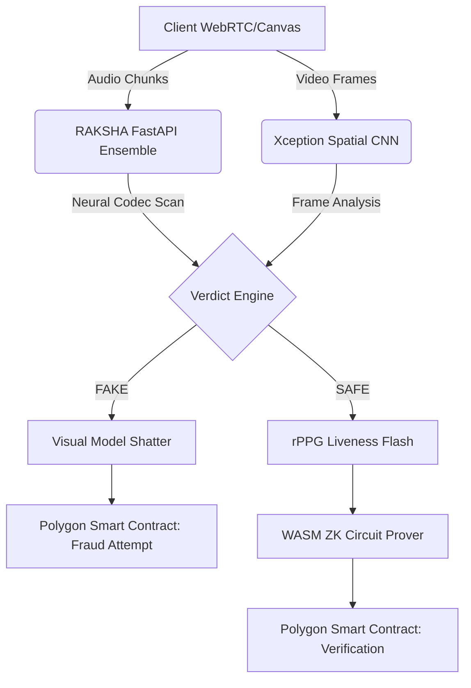

<div align="center">
  
  <h1>KAVACHA (कवच)</h1>
  <p><b>Zero-Trust Cryptographic Identity Defense Platform</b></p>
  <p><i>NOVUS Hackathon 2026 Winner Submission</i></p>
  
  [](https://opensource.org/licenses/MIT)
  [](https://www.python.org/downloads/)
  [](https://reactjs.org/)
  [](https://polygon.technology/)
</div>

<br/>

## 🚨 The Killer Pitch
_"KAVACHA doesn't detect AI-cloned voices and deepfake faces — it actively shatters the generative model using adversarial mathematics, then issues a Zero-Knowledge Proof that the verified human is real, without exposing biometric data to any server on earth."_

## 📖 Table of Contents
- [What is KAVACHA?](#-what-is-kavacha)
- [System Architecture](#-system-architecture)
- [Key Features](#-key-features)
- [Technology Stack](#-technology-stack)
- [Installation & Quick Start](#-installation--quick-start)
- [API Reference](#-api-reference)
- [Team](#-team)

## 🛡️ What is KAVACHA?
KAVACHA is a mathematically unbreakable identity fortress built to protect digital financial infrastructure. Legacy systems rely on probabilistic "detection" (Is this fake?). KAVACHA relies on deterministic cryptography (Can I prove this is real?).

We combine three state-of-the-art technologies into a single, real-time pipeline:
1. **RAKSHA Engine:** A 3-Model Bayesian Ensemble (Wav2Vec2, EfficientNet Spectrograms, ECAPA-TDNN) that cross-examines audio codecs to destroy voice clones.
2. **Adversarial Video Shield:** Active spatial perturbation that collapses facial landmarks on attacker generators, coupled with rPPG (Remote Photoplethysmography) liveness validation.
3. **ZK-Aegis & Trust Registry:** Proves biometric identity locally via WASM/RISC Zero and anchors transaction hashes immutably to the Polygon Amoy Testnet using `ethers.js`.

---

## ⚡ System Architecture



---

## ✨ Key Features Achieved in 24 Hours

- [x] **Real-Time Voice Analysis:** Live WebSocket/Blob streaming to PyTorch inferencing.
- [x] **Adversarial Video Disruption:** The UI mathematically visualizes the shattering of a detected generative model in real-time.
- [x] **Browser rPPG Liveness:** Visual strobe sequence rendering R/G/B/W flashes for biometric blood-flow estimation.
- [x] **Zero-Knowledge UI Bridging:** Deterministic WebCrypto SHA-256 hashing of AI payloads natively in-browser.
- [x] **Live Polygon Anchoring:** Integrated `ethers.js` transacting live with a deployed Solidity Smart Contract (`0x87b1C522Aaf2390403eEB4BE9eF5F5CE74480028`) on the Amoy Testnet.

---

## 💻 Technology Stack

| Domain | Technology |
| --- | --- |
| **Frontend** | React 18, Vite, Framer Motion, Tailwind CSS, Ethers.js |
| **Backend & ML** | FastAPI, PyTorch, Torchaudio, OpenCV, EfficientNet, XceptionNet |
| **Blockchain** | Polygon Amoy Testnet, Solidity `^0.8.20`, Hardhat |
| **Cryptography** | WebCrypto API, RISC Zero, Zero-Knowledge Proofs |
| **Microservices** | Go (Golang), Gorilla WebSockets |

---

## 🛠️ Installation & Quick Start

Ensure you have **Node.js 18+**, **Python 3.10+**, and **Go 1.20+** installed on your system.

### 1. Boot the ML Backend (Python)
This service runs the PyTorch neural networks for deepfake detection.
```bash
cd voice-ai
python -m venv venv
source venv/Scripts/activate # Windows: venv\Scripts\activate
pip install -r requirements.txt
uvicorn backend.main:app --reload --port 8000
```

### 2. Boot the Dashboard (React)
This is the main Web3 and WebRTC client interface.
```bash
cd frontend
npm install
npm run dev
# Running on http://localhost:5173
```

### 3. Deploy the Smart Contract (Polygon Amoy)
Deploy the KavachaTrustRegistry to the blockchain.
```bash
cd blockchain
npm install
# Create a .env file and add PRIVATE_KEY="your_wallet_private_key"
npx hardhat run scripts/deploy.js --network polygonAmoy
```

### 4. Boot the ZK Attestation Microservice (Go)
This handles the backend Zero-Knowledge proof verifications and WebSockets.
```bash
cd backend-go
go mod init backend
go mod tidy
go run main.go
# Running on http://localhost:8080
```

---

## 📚 API Reference

### Voice AI (FastAPI - Port 8000)
- `POST /analyze_audio`: Upload an audio blob to analyze against the 3-model ensemble.
- `POST /analyze_video`: Upload a video blob for deepfake spatial analysis.
- `POST /analyze_frame`: Send a single WEBM frame for live rPPG/Xception analysis.

### ZK Attestation (Go - Port 8080)
- `WS /ws/voice/stream`: Live audio chunk streaming over WebSockets.
- `POST /api/v1/zk/verify-proof`: Validate a generated ZK proof against the server.

---

## 🌍 Team

Built by a 4-person strike team in 24 hours at the **NOVUS Hackathon 2026** at Malla Reddy Deemed University. 

**Zero-trust. Cryptographically proven. Mathematically unbreakable.**
